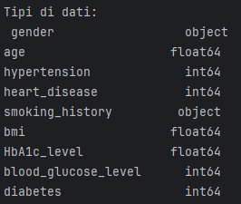
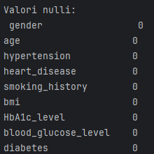
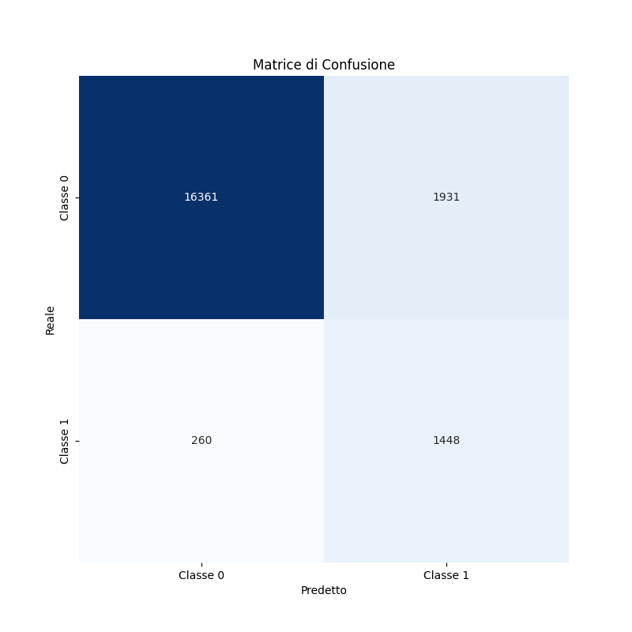
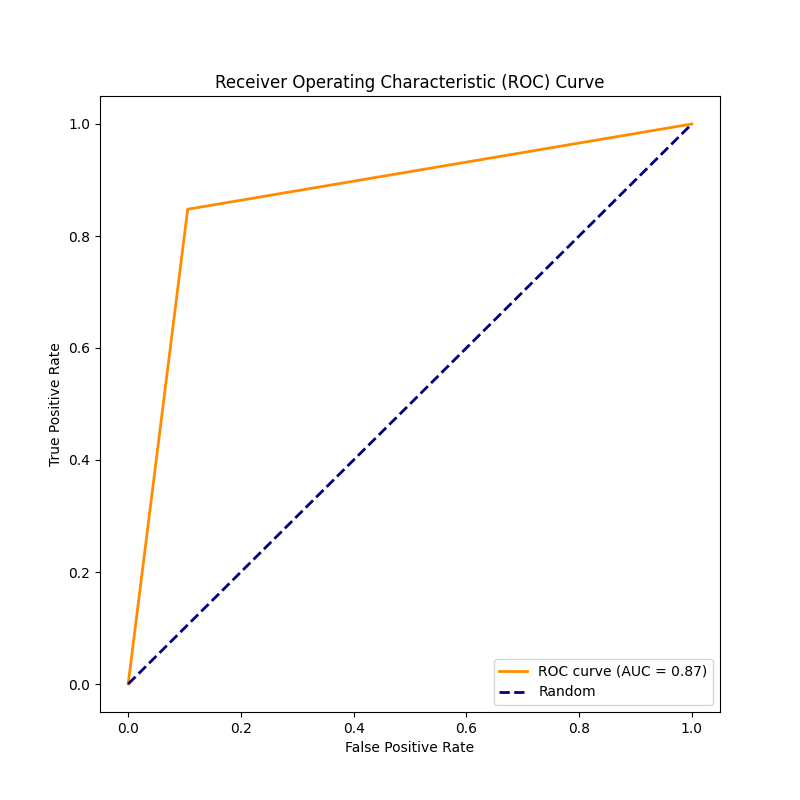
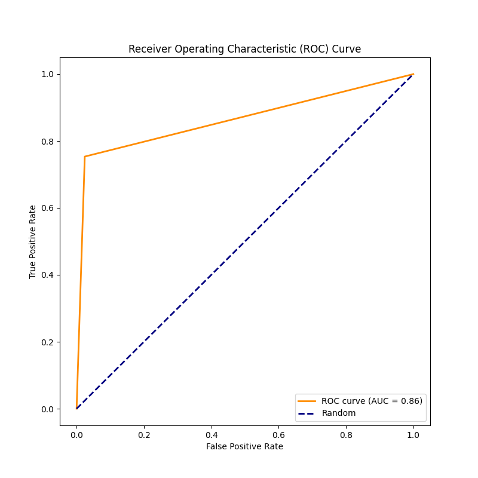
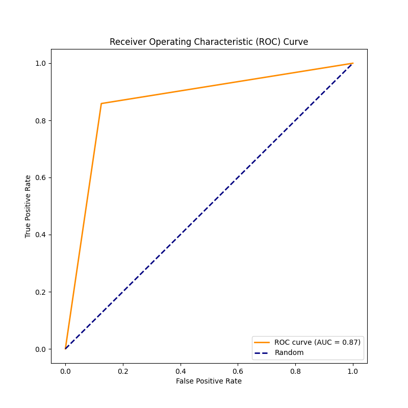

# DiabetePredictor360

## Introduzione
Il diabete rappresenta una delle sfide globali più significative nel campo della salute, con un impatto crescente sulla qualità della vita dei pazienti e sul sistema sanitario. In risposta a questa sfida, l'uso della tecnologia e dell'intelligenza artificiale, in particolare del machine learning, ha aperto nuove prospettive per affrontare la prevenzione e la gestione della patologia. Questo studio si concentra sull'applicazione di modelli di machine learning per la predizione del diabete, utilizzando il **Diabetes Prediction Dataset**. L'implementazione di modelli di machine learning per la predizione del diabete non solo potrebbe agevolare la diagnosi precoce e la personalizzazione dei piani di trattamento, ma potrebbe anche contribuire alla comprensione più approfondita delle interazioni complesse tra fattori medici e demografici. Questo studio si propone di confrontare diversi modelli di machine learning, valutando le loro prestazioni nel predire lo stato diabetico dei pazienti e fornendo così informazioni preziose per la comunità medica e scientifica.

## Metodologia

### 1. Descrizione del Dataset
Il dataset utilizzato per questo esperimento è il *Diabetes Prediction dataset*, una raccolta di dati medici e demografici provenienti da pazienti, insieme al loro stato diabetico (positivo o negativo). Il dataset è composto dalle seguenti variabili:

- Età (Age): La fascia d'età del paziente.
- Genere (Gender): Il genere del paziente (maschio o femmina).
- Indice di Massa Corporea (BMI): Il rapporto tra il peso e l'altezza del paziente.
- Ipertensione (Hypertension): La presenza o assenza di ipertensione nel paziente.
- Malattia cardiaca (Heart Disease): La presenza o assenza di malattia cardiaca nel paziente.
- Storico sul fumo (Smoking History): L'eventuale abitudine al fumo del paziente.
- Livello di HbA1c (HbA1c Level): Il livello di emoglobina A1c nel sangue del paziente.
- Livello di glucosio nel sangue (Blood Glucose Level): Il livello di glucosio nel sangue del paziente.
- Stato diabetico (Diabetes Status): Indica se il paziente è positivo o negativo per il diabete.

Questo dataset è stato selezionato per consentire lo sviluppo di modelli di machine learning volti a prevedere la presenza diabete nei pazienti in base alla loro storia medica e alle informazioni demografiche. L'utilizzo di questi modelli potrebbe essere di grande beneficio per gli operatori sanitari nell'identificare pazienti a rischio di sviluppare il diabete e nel formulare piani di trattamento personalizzati.

#### Data analysis

Importiamo il dataset
```python=
dtl = pd.read_csv('diabetes_prediction_dataset.csv')
```

Visualizziamo un'anteprima dei dati
```python=
print(dtl.head())
```
*Output:*  


Verifichiamo le dimensioni del dataset
```python=
print('DIMENSIONE DATASET: ', dtl.shape)
```

*Output:*  


Visualizziamo il tipo per ogni feature
```python=
print('Tipi di dati: ', dtl.dtypes)
```
*Output:*  


Verifichiamo se all'interno del dataset ci sono valori nulli
```python=
print('Valori nulli: \n', dtl.isnull().sum())
```
*Output:*  


**Il dataset non presenta valori nulli**

Studiando la distribuzione dei dati nel dataset, notiamo uno sbilanciamento delle classi della variabile target *'diabetes'*


### 2. Scelta dei Modelli
Per la scelta dei modelli abbiamo considerato una vasta gamma di approcci per la predizione del diabete. La Logistic Regression fornisce una semplice interpretazione probabilistica, RandomForest gestisce complessità e non linearità, mentre Naive Bayes è efficiente e può funzionare bene con dataset di dimensioni più ridotte.

- **Logistic Regression**: E' un modello statistico utilizzato per la predizione di variabili binarie. Nel contesto della predizione del diabete, la regressione logistica può essere adatta poiché il nostro target è binario (positivo o negativo per il diabete). Il modello stima la probabilità di appartenenza a una classe rispetto all'altra, offrendo interpretazioni chiare delle relazioni tra le variabili di input e l'output.
- **RandomForest**: E' un modello basato su alberi decisionali che combina diversi alberi per migliorare la stabilità e la precisione delle previsioni. Nel contesto della predizione del diabete, RandomForest è utile per gestire complessità e non linearità nei dati. Può catturare relazioni complesse tra molteplici variabili e può essere resistente al overfitting, migliorando la generalizzazione del modello.
- **Naive Bayes**: E' basato sul teorema di Bayes e assume l'indipendenza condizionale tra le caratteristiche di input. Nel caso della predizione del diabete, Naive Bayes potrebbe essere adatto per modellare la probabilità condizionale della presenza di diabete date le caratteristiche del paziente.


## Codice dei Modelli

In questa sezione, forniremo una breve spiegazione del codice implementato per i modelli di machine learning.


### Modello 1: [Regressione Logistica]

Visualizziamo ora il codice del modello di *Regressione logistica* nel dettaglio, mettendo in evidenza le scelte progettuali effettuate.  
Iniziamo con il definire i *feature vector* e *target variable*.
```python=
X = dtl.drop(['diabetes'], axis=1)
y = dtl['diabetes']
```

Utilizzando la libreria **scikitLearn** effettuiamo lo split dei dati seguendo la regola di Pareto, ossia 80% train e 20% test.

```python=
X_train, X_test, y_train, y_test = train_test_split(X, y, test_size=0.20, random_state=42)
```

Successivamente andiamo a selezionare le features categoriche. Qui viene inizializzato poi un oggetto OrdinalEncoder dal modulo **category_encoders**. Questo encoder sarà utilizzato per convertire le variabili categoriche in numeri ordinali.

```python=
#Seleziono le feature categoriche
colonne_categoriche = dtl.select_dtypes(include=['object']).columns.tolist()
# Visualizza le colonne categoriche
print("Feature Categoriche:")
print(colonne_categoriche)

encoder = ce.OrdinalEncoder(cols= colonne_categoriche)

X_train = encoder.fit_transform(X_train)
X_test = encoder.transform(X_test)
```

Come mostrato nella sezione di *data analysis* il dataset presenta uno sbilanciamento importante. Decidiamo quindi di applicare la tecninca di campionamento dinamico **SMOTETomek**.
Esso combina oversampling e undersampling utilizzando SMOTE e Tomek Links insieme.  
**N.B.: il bilanciamento viene effettuato solamente sui dati di addestramento**

```python=
smotetomek = SMOTETomek(sampling_strategy='auto', random_state=42)
X_train, y_train = smotetomek.fit_resample(X_train, y_train)
```

Una volta bilanciati i dati di addestramento, procediamo con lo scaling, utilizzando **MinMaxScaler()** dal modulo **sklearn.preprocessing**. Utilizzando un modello di regressione logistica, lo scaling diventa importante poichè esso permette al modello di convergere più velocemente ed inotre si va a mitigare l'influenza di quelli che vengono definiti dati *outlier*.

```python=
scaler = MinMaxScaler()

X_train = scaler.fit_transform(X_train)
X_test = scaler.transform(X_test)
X_train = pd.DataFrame(X_train, columns=[cols])
X_test = pd.DataFrame(X_test, columns=[cols])
```

Andiamo ora ad utilizzare la tecnica di **AutoML** attraverso il modulo **GridSearchCV** per la ricerca degli iperparametri ottimali. Prima di tutto definiamo un dizionario '*param_grid*' in cui specifichiamo una griglia di iperparametri che si desidera testare. Successivamente si istanzia un *grid_search* e lo si addestra sui dati di train. Una volta terminato l'addestramento, otteniamo il miglior modello attravero *grid_search.best_estimator_* e otteniamo poi le predizioni sui dati di test.

```python=
logistic_regression = LogisticRegression()

param_grid = {
    'C': [0.001, 0.01, 0.1, 1, 10, 100],
    'penalty': ['l1', 'l2']
}

grid_search = GridSearchCV(logistic_regression, param_grid, cv=5, scoring='accuracy')

grid_search.fit(X_train, y_train)

best_params = grid_search.best_params_
print("Migliori parametri:", best_params)

model = grid_search.best_estimator_

prediction = model.predict(X_test)
```

Verifichiamo che il modello non mostri **Overfitting**, andando ad analizzare il training set score (accuratezza del modello sui dati utilizzati per addestrarlo) e test set score (accuratezza del modello su dati che non ha mai visto durante l'addestramento). L'overfitting si verifica quando il modello si adatta troppo ai dati di addestramento e acquisisce dettagli e rumore specifici di quei dati che potrebbero non essere rappresentativi del problema generale. Se il punteggio del training set è molto più alto rispetto al punteggio del test set, è possibile che il modello abbia memorizzato il training set anziché apprendere i pattern generali.

```python=
print('Training set score: {:.4f}'.format(model.score(X_train, y_train)))
print('Test set score: {:.4f}'.format(model.score(X_test, y_test)))
```

### Modello 2: [Random Forest]

Visualizziamo ora il codice del modello di *Random Forest* nel dettaglio, mettendo in evidenza le scelte progettuali effettuate.  
Iniziamo con il definire i *feature vector* e *target variable*.
```python=
X = dtl.drop(['diabetes'], axis=1)
y = dtl['diabetes']
```

Utilizzando la libreria **scikitLearn** effettuiamo lo split dei dati seguendo la regola di Pareto, ossia 80% train e 20% test.

```python=
X_train, X_test, y_train, y_test = train_test_split(X, y, test_size=0.20, random_state=42)
```
Successivamente andiamo a selezionare le features categoriche. Qui viene inizializzato poi un oggetto OrdinalEncoder dal modulo **category_encoders**. Questo encoder sarà utilizzato per convertire le variabili categoriche in numeri ordinali.

```python=
colonne_categoriche = dtl.select_dtypes(include=['object']).columns.tolist()
# Visualizza le colonne categoriche
print("Feature Categoriche:")
print(colonne_categoriche)

encoder = ce.OrdinalEncoder(cols= colonne_categoriche)

X_train = encoder.fit_transform(X_train)
X_test = encoder.transform(X_test)
```

Come mostrato nella sezione di *data analysis* il dataset presenta uno sbilanciamento importante. Decidiamo quindi di applicare la tecninca di campionamento dinamico **SMOTETomek**.
Esso combina oversampling e undersampling utilizzando SMOTE e Tomek Links insieme.  
**N.B.: il bilanciamento viene effettuato solamente sui dati di addestramento**

```python=
smotetomek = SMOTETomek(sampling_strategy='auto', random_state=42)
X_train, y_train = smotetomek.fit_resample(X_train, y_train)
```
Andiamo ora ad utilizzare la tecnica di **AutoML** attraverso il modulo **GridSearchCV** per la ricerca degli iperparametri ottimali. Prima di tutto definiamo un dizionario '*param_grid*' in cui specifichiamo una griglia di iperparametri che si desidera testare. Successivamente si istanzia un *grid_search* e lo si addestra sui dati di train. Una volta terminato l'addestramento, otteniamo il miglior modello attravero *grid_search.best_estimator_* e otteniamo poi le predizioni sui dati di test.

```python=
random_forest = RandomForestClassifier()

param_grid = {
    'n_estimators': [50, 100, 200],
    'max_depth': [None, 10, 20, 30],
    'min_samples_split': [2, 5, 10],
    'min_samples_leaf': [1, 2, 4]
}

grid_search = GridSearchCV(random_forest, param_grid, cv=5, scoring='accuracy')

grid_search.fit(X_train, y_train)

best_params = grid_search.best_params_
print("Migliori parametri:", best_params)

model = grid_search.best_estimator_

prediction = best_model.predict(X_test)
```
Verifichiamo che il modello non mostri **Overfitting**, andando ad analizzare il training set score (accuratezza del modello sui dati utilizzati per addestrarlo) e test set score (accuratezza del modello su dati che non ha mai visto durante l'addestramento). L'overfitting si verifica quando il modello si adatta troppo ai dati di addestramento e acquisisce dettagli e rumore specifici di quei dati che potrebbero non essere rappresentativi del problema generale. Se il punteggio del training set è molto più alto rispetto al punteggio del test set, è possibile che il modello abbia memorizzato il training set anziché apprendere i pattern generali.

```python=
print('Training set score: {:.4f}'.format(model.score(X_train, y_train)))
print('Test set score: {:.4f}'.format(model.score(X_test, y_test)))
```


### Modello 3 : [Naive Bayes]

Visualizziamo ora il codice del modello di *Naive Bayes* nel dettaglio, mettendo in evidenza le scelte progettuali effettuate.  
Iniziamo con il definire i *feature vector* e *target variable*.
```python=
X = dtl.drop(['diabetes'], axis=1)
y = dtl['diabetes']
```

Utilizzando la libreria **scikitLearn** effettuiamo lo split dei dati seguendo la regola di Pareto, ossia 80% train e 20% test.

```python=
X_train, X_test, y_train, y_test = train_test_split(X, y, test_size=0.20, random_state=42)
```

Successivamente andiamo a selezionare le features categoriche. Qui viene inizializzato poi un oggetto OrdinalEncoder dal modulo **category_encoders**. Questo encoder sarà utilizzato per convertire le variabili categoriche in numeri ordinali.

```python=
#Seleziono le feature categoriche
colonne_categoriche = dtl.select_dtypes(include=['object']).columns.tolist()
# Visualizza le colonne categoriche
print("Feature Categoriche:")
print(colonne_categoriche)

encoder = ce.OrdinalEncoder(cols= colonne_categoriche)

X_train = encoder.fit_transform(X_train)
X_test = encoder.transform(X_test)
```

Come mostrato nella sezione di *data analysis* il dataset presenta uno sbilanciamento importante. Decidiamo quindi di applicare la tecninca di campionamento dinamico **SMOTETomek**.
Esso combina oversampling e undersampling utilizzando SMOTE e Tomek Links insieme.  
**N.B.: il bilanciamento viene effettuato solamente sui dati di addestramento**

```python=
smotetomek = SMOTETomek(sampling_strategy='auto', random_state=42)
X_train, y_train = smotetomek.fit_resample(X_train, y_train)
```
Una volta bilanciati i dati di addestramento, procediamo con lo scaling, utilizzando **RobustScaler** dal modulo **sklearn.preprocessing**. Utilizzando un modello Naive Bayes, lo scaling diventa importante poichè esso permette al modello di convergere più velocemente ed inotre si va a mitigare l'influenza di quelli che vengono definiti dati *outlier*.

```python=
cols = X_train.columns

scaler = RobustScaler()
X_train = scaler.fit_transform(X_train)

X_test = scaler.transform(X_test)
X_train = pd.DataFrame(X_train, columns=[cols])
X_test = pd.DataFrame(X_test, columns=[cols])
```

Definiziamo ora il modello **GaussianNB**. Come si può notare, non è stata utilizzata alcuna tecnica di AutoML poichè questo modello in particolare non ha iperparametri specifici che devono essere ottimizzati. Definiziamo quindi semplicemente il modello, lo addestriamo sui dati di train e otteniamo le predizioni sui dati di test.

```python=
model = GaussianNB()
model.fit(X_train, y_train)
prediction = model.predict(X_test)
```
Verifichiamo che il modello non mostri **Overfitting**, andando ad analizzare il training set score (accuratezza del modello sui dati utilizzati per addestrarlo) e test set score (accuratezza del modello su dati che non ha mai visto durante l'addestramento). L'overfitting si verifica quando il modello si adatta troppo ai dati di addestramento e acquisisce dettagli e rumore specifici di quei dati che potrebbero non essere rappresentativi del problema generale. Se il punteggio del training set è molto più alto rispetto al punteggio del test set, è possibile che il modello abbia memorizzato il training set anziché apprendere i pattern generali.

```python=
print('Training set score: {:.4f}'.format(model.score(X_train, y_train)))
print('Test set score: {:.4f}'.format(model.score(X_test, y_test)))
```

### 4. Metriche di Valutazione
Nella sezione delle "Metriche di Valutazione", analizzeremo attentamente le prestazioni dei modelli di machine learning utilizzando strumenti fondamentali come la Confusion Matrix insieme a metriche chiave come Accuracy, Recall, Precision e F1-score. La visualizzazione di queste metriche attraverso Matplotlib permetterà di interpretare in modo chiaro le prestazioni dei modelli nella classificazione, facilitando una comprensione visiva e approfondita dei risultati ottenuti nel contesto dell'esperimento di machine learning.

#### Metriche di valutazione - codice

Calcoliamo la confusion matrix e definiamo una *heatmap* per la visualizzazione dei risultati utilizzando la libreria **Seaborn**.
```python=
confMatrix = confusion_matrix(y_test, prediction)
plt.figure(figsize=(8,8))

sns.heatmap(confMatrix, annot=True, fmt="d", cmap="Blues", cbar=False,
            xticklabels=['Classe 0', 'Classe 1'], yticklabels=['Classe 0', 'Classe 1'])

plt.title('Matrice di Confusione')
plt.xlabel('Predetto')
plt.ylabel('Reale')
plt.show()
```

Calcoliamo ora le metriche di valutazione utilizzando i dati ottenuti dalla confusion matrix.

```python=
TN, FP, FN, TP = confMatrix.ravel()

recall = TP / (TP + FN)
precision = TP / (TP + FP)
f1_score = 2 * (precision * recall) / (precision + recall)
accuracy = (TP + TN) / (TP + TN + FP + FN)

print('Recall: {:.4f}'.format(recall))
print('Precision: {:.4f}'.format(precision))
print('F1-Score: {:.4f}'.format(f1_score))
print('Accuracy: {:.4f}'.format(accuracy))
```

Successivamente calcoliamo la **ROC curve**, mostrandola graficamente con **Matplotlib**.

```python=
fpr, tpr, thresholds = roc_curve(y_test, prediction)
roc_auc = auc(fpr, tpr)

plt.figure(figsize=(8, 8))
plt.plot(fpr, tpr, color='darkorange', lw=2, label='ROC curve (AUC = {:.2f})'.format(roc_auc))
plt.plot([0, 1], [0, 1], color='navy', lw=2, linestyle='--', label='Random')
plt.xlabel('False Positive Rate')
plt.ylabel('True Positive Rate')
plt.title('Receiver Operating Characteristic (ROC) Curve')
plt.legend(loc='lower right')
plt.show()
```

## Risultati
Riportiamo in questa sezione i risultati ottenuti per ogni modello.
**N.B. i risultati sono relativi ai modelli definiti senza l'utlizzo di AutoML. Si rimanda il lettore al codice presente alla repository allegata di sotto per una maggiore comprensione.**

### Regressione Logistica

#### *Confusion Matrix*


**Recall: 0.8478  
Precision: 0.4285  
F1-Score: 0.5693  
Accuracy: 0.8904**  


#### *ROC curve*


### Random Forest

#### *Confusion Matrix*


**Recall: 0.7535  
Precision: 0.7435  
F1-Score: 0.7485  
Accuracy: 0.9567**  


#### *ROC curve*



### Naive Bayes

#### *Confusion Matrix*


**Recall: 0.8589  
Precision: 0.3908  
F1-Score: 0.5372  
Accuracy: 0.8736**  

#### *ROC curve*


## Conclusione
Dopo un'attento studio dei risultati delle metriche di valutazione ottenuti, è evidente come RandomForest si è distintamente imposto come l'algoritmo più performante. L'ascesa di RandomForest come vincitore del confronto tra modelli sottolinea la sua notevole capacità di adattarsi a complessità e pattern non lineari presenti nei dati del diabete. La sua natura basata su ensemble di alberi decisionali consente una maggiore robustezza rispetto ad approcci lineari come la regressione logistica. Mentre RandomForest eccelle in termini di performance predittive, la sua complessità potrebbe limitare la facilità di interpretazione, cruciale per gli operatori sanitari. In contrasto, la regressione logistica offre una comprensione più chiara delle relazioni lineari, anche se potrebbe non catturare la complessità dei dati in modo completo. In conclusione, i risultati del nostro studio sottolineano l'importanza dell'adozione di modelli avanzati come RandomForest nella predizione del diabete.

## Riferimenti
- Dataset: https://www.kaggle.com/datasets/iammustafatz/diabetes-prediction-dataset
- Repository: https://github.com/danielepalomba/DiabetePredictor360.git

